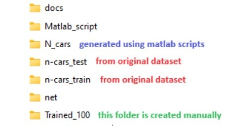

# FastSpiker: Enabling Fast Training for Spiking Neural Networks on Event-based Data Through Learning Rate Enhancements for Autonomous Embedded Systems

FastSpiker is a novel methodology that enables fast SNN training on event-based data through learning rate enhancements targeting autonomous embedded systems. In FastSpiker, we explore different learning rate policies to find the appropriate policies. Experimental results show that our FastSpiker offers up to l0.5x faster training time and up to 88.39% lower carbon emission to achieve higher or comparable accuracy to the state-of-the-art on the event-based automotive dataset (i.e., NCARS). In this manner, our Fast-Spiker methodology paves the way for green and sustainable computing in realizing embodied neuromorphic intelligence for autonomous embedded systems.

## Create Conda Environment (if required): 
```
conda create --name fastspiker python=3.8
```

## Installation: 
Ensure to fulfill the library requirements:
```
pip install numpy torch torchvision
```

## Preparation: 
Prepare the working folders as shown like this figure. 
<p align="left"></p>

To do this, first prepare the original N-CARS dataset (n-cars_test & n-cars_train), which can be downloaded from this [link](https://www.prophesee.ai/2018/03/13/dataset-n-cars/).

Then, generate the modified dataset (N_cars) using matlab scripts, which will create the N_cars folder.   

Afterwards, create "Trained_100" folder and run the example below.

## Example of command to run the code:
```
CUDA_VISIBLE_DEVICES=0 python3 main.py --filenet ./net/net_1_4a32c3z2a32c3z2a_100_100_no_ceil.txt --fileresult ./results/exp_warmrestart_2peaks --batch_size 40 --lr 1e-3 --lr_decay_epoch 20 --lr_decay_value 0.5 --lr_policy 1 --threshold 0.4 --att_window 100 100 0 0 --sample_length 10 --sample_time 1 
```

## Citation
If you use FastSpiker in your research or find it useful, kindly cite the following [article](https://doi.org/10.1109/ICARCV63323.2024.10821701):
```
@INPROCEEDINGS{Ref_Bano_FastSpiker_ICARCV24,
  author={Bano, Iqra and Wicaksana Putra, Rachmad Vidya and Marchisio, Alberto and Shafique, Muhammad},
  booktitle={2024 18th International Conference on Control, Automation, Robotics and Vision (ICARCV)}, 
  title={FastSpiker: Enabling Fast Training for Spiking Neural Networks on Event-based Data Through Learning Rate Enhancements for Autonomous Embedded Systems}, 
  year={2024},
  volume={},
  number={},
  pages={428-434},
  keywords={Training;Accuracy;Embedded systems;Event detection;Neuromorphics;Carbon dioxide;Spiking neural networks;Robots;Faces;Automotive engineering},
  doi={10.1109/ICARCV63323.2024.10821701}}

```

This work is inspired from the work of SNN4Agents: [paper](https://doi.org/10.3389/frobt.2024.1401677) & [code](https://github.com/rachmadvwp/SNN4Agents).


